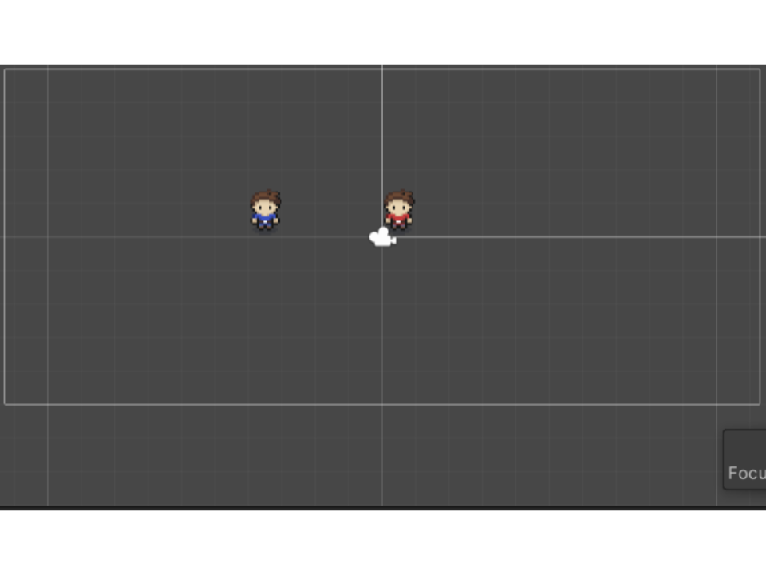
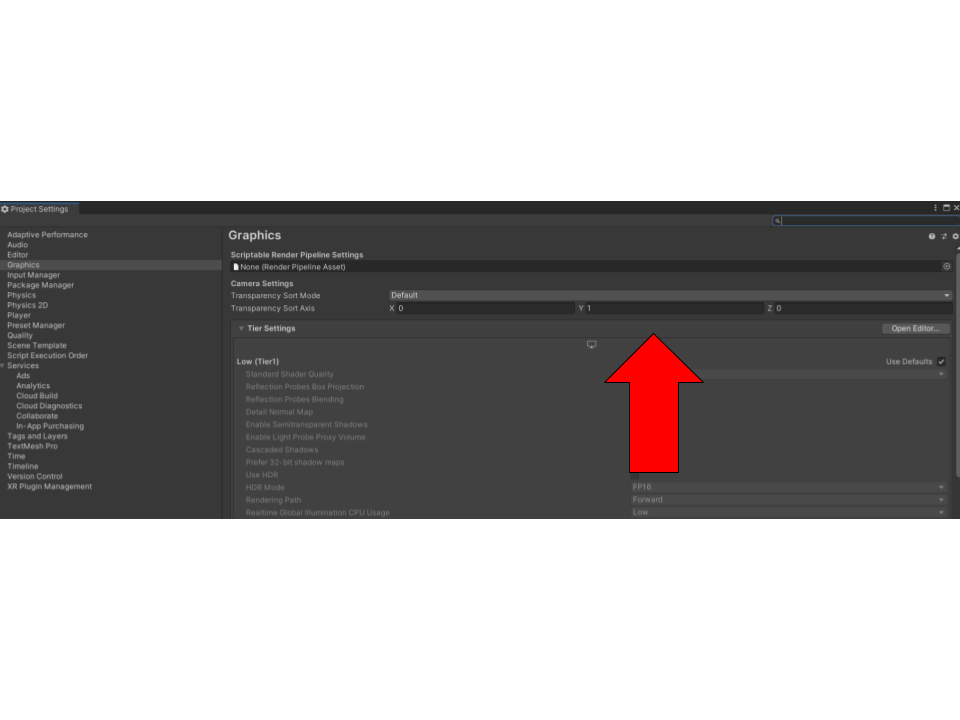
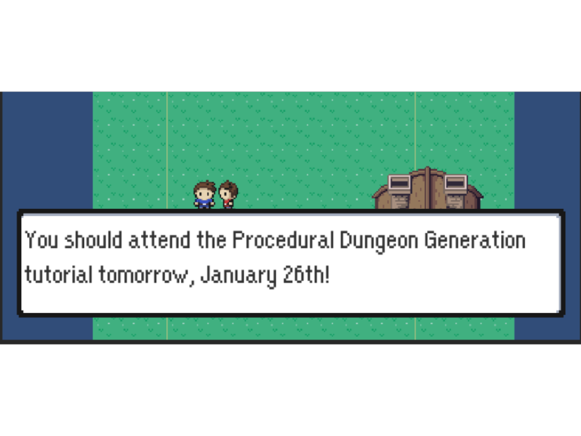

# Studio Beginner Tutorials - Build an RPG: Overworld
 
**Date**: January 25th, 2022, 7:00 pm - 9:00 pm<br>
**Location**: Zoom<br>
**Instructor**: Matthew Workman
 
## Resources
[Slides](https://docs.google.com/presentation/d/1mX_tNAdCScIx0Qo3Y7ENI4bEb0RpwjQv5inyaSVVshQ/edit?usp=sharing)<br>
[Video Soon!](https://youtu.be/QMbWMkJXs5g)<br>
 
## Topics Covered
* Setting up a player and movement
* Creating boundaries/a route 
* Creating an NPC and Wild Pokémon Encounters
 
## What you'll need
* [Unity Hub](https://unity.com/download)
* [Unity 2020.3.15f2](https://unity3d.com/unity/qa/lts-releases)
* [Git](https://git-scm.com/downloads)
* [Skeleton Package](https://drive.google.com/file/d/1dfWnvE7orxTojZJ7phKna36nYpdVWnZr/view?usp=sharing)

---

## Setting Up Your Scene
In order to start, please download and import the [skeleton package](https://drive.google.com/file/d/1dfWnvE7orxTojZJ7phKna36nYpdVWnZr/view?usp=sharing) into your own Unity 2D project.

---
## The Scenes
The [skeleton package](https://drive.google.com/file/d/1dfWnvE7orxTojZJ7phKna36nYpdVWnZr/view?usp=sharing) includes all the assets needed for the Overworld scene (and a completed version of the previous week's Combat Scene) and has things set up so that we can add scripts to make it playable. Before we get into that though, we want to go over what is in the scene. The Overworld scene should look like this:

<br>

Just two guys, 5 undetermined units of measurement apart for arbitrary reasons. 

## Initial Objects 
Some objects, like the Player, NPC, and some Tilemaps exist already. Don't worry, they don't work yet; their attached scripts and other aspects of those objects will be filled in during the tutorial. They exist right now just to avoid spending the time it takes to create them. (Also, the player has some animations in already, so it's more easily visible what direction they are facing)

## Initial Scripts
We have provided some initial scripts that we will be using in this project. These scripts are not too long, so we don't want to spend a long time going over them, but we will provide a brief description of what they do.

## Interactable
This script is an interface that requires the classes connected to it to implement some Interaction() function. Although we only have one interaction in this tutorial, this interface has been included in case you wanted to expand on what you learn.

```c#
using System.Collections;
using System.Collections.Generic;
using UnityEngine;

public interface Interactable
{
    public void Interaction();
}
```

## Dialogue
This script is for the Dialogue class, which is essentially just a list of dialogue lines. This way, if you wanted to attempt to create a more complicated dialogue system than this tutorial will cover, you could go beyond just 1 line. 

```c#
using System.Collections;
using System.Collections.Generic;
using UnityEngine;

[System.Serializable]

public class Dialogue
{

    [SerializeField] List<string> lines;

    public List<string> Lines
    {
        get { return lines; }
    }
}
```

## Putting the Layer in Player (and some other objects)
First, we should put in some background tiles. We can do this by going to the `Tile Palette`, accessible through `Window->2D->Tile Palette`. There should already be an existing tile set called `background tiles`. We'll just click on a grass icon and make a large enough rectangle to encompass our `Player` and `npc_0` as well as some other things we'll place later. Make sure the 'Active Tilemap` (seen in the `Tile Palette` window) is on `Background` when you do this. 

Next, we go to `Layers->Edit Layers->Sorting Layers` and add the following layers in order: `Background`, `Foreground`, and `Player`. `Background` should be vertically highest and `Player` should be vertical lowest to ensure everything is on top of what it should be on top of. Now we go to our `Player` Object and set its `Sorting Layer` to `Player`. Then, set the 'Background' Object's 'Sorting Layer' to 'Background'. The `Sorting Layer` is assignable within the `Tilemap Renderer`.

<br>

<br>

## Player Movement
Now we can begin implementing the scripts attached to our objects, beginning first with our Player. In order to implement movement, we will first need to add variables to hold the information we need (how fast the player should move, whether or not the player is moving, and the user's input)

```c#
public float moveSpeed;
private bool isMoving;
private Vector2 input;
```

Next, we need to make a `IEnumerator Move(Vector3 targetPos)` function that moves our player to their target position and set isMoving to true as it's moving our Player.   

```c#
IEnumerator Move(Vector3 targetPos) {
        
        isMoving = true;
        
        while ((targetPos - transform.position).sqrMagnitude > Mathf.Epsilon) {
            transform.position = Vector3.MoveTowards(transform.position, targetPos, moveSpeed * Time.deltaTime);
            yield return null;
        }
        transform.position = targetPos;

        isMoving = false;
}
```

Now that we have a way to move our player, it needs to be used. In the `void Update()` function, we'll add:
```c#
if (!isMoving) {
            input.x = Input.GetAxisRaw("Horizontal");
            input.y = Input.GetAxisRaw("Vertical");

            //if you don't want diagonal movement
            if (input.x != 0)
                input.y = 0;

            if (input != Vector2.zero) {
                animator.SetFloat("moveX", input.x); //don't worry about these animator lines too much
                animator.SetFloat("moveY", input.y); //the main takeaway is that they set values that allow us to determine what direction we're facing

                var targetPos = transform.position;
                targetPos.x += input.x;
                targetPos.y += input.y;

                StartCoroutine(Move(targetPos)); 
            }
}
```
to get the user's input and move the player accordingly.

## Collisions
Now that our player can walk, let's add some things that get in their way. After clicking on the `SolidObjects` tilemap (under `Grid`) and switching the tile set in `Tile Palette` from `background tiles` to `overworld`, we can begin to place some solid objects. After selecting and placing some things from the tileset to serve as obstacles/barriers, set the `Sorting Layer` of `SolidObjects` to `Foreground`.

Next, we add a `Layer` (*not* a `Sorting Layer`) called `Solid Objects`. We can also add `Layer`s named `Tall Grass` and `Interactable` to use later. Set the `Layer` of `SolidObjects` to `Solid Objects`.

Afterwards, we add the following components:
* **Tilemap Collider 2D**
* **Composite Collider 2D** (this will also add a `Rigid Body 2D`, change its `Body Type` to `Static`)
(check the box for `Used By Composite` in the `Tilemap Collider 2D` and change the `Geometry Type` of the `Composite Collider 2D` to `Polygons`)

<br>

<br>

### Returning to Scripting
We must now add to our `PlayerMovement` script to check if the space we're trying to walk into is actually walkable. 

Add the variable for the `Solid Objects` layer (and other layers we will use in the future):
```c#
    public LayerMask solidObjectsLayer;
    public LayerMask grassLayer;
    public LayerMask interactableLayer;
```
Remember to assign the layers within the `PlayerMovement` script by looking at it in the `Inspector`.


```c#
private bool IsWalkable(Vector3 targetPos) {
        if (Physics2D.OverlapCircle(targetPos, .1f, solidObjectsLayer) != null) {
            Debug.Log("can't walk there");
            return false;
            
        }
        return true;
}
```
and in our `void Update()` function, we place `StartCoroutine(Move(targetPos))' in an if statement for whether or not the target position is walkable
```c#
if(IsWalkable(targetPos))
                    StartCoroutine(Move(targetPos)); 
```


## Tall Grass Encounters
Now we begin the process of adding some grass to our scene by clicking on the `Tall Grass` tilemap in the hierarchy. We set the `Sorting Layer` to `Foreground` and the 'Layer' to 'Tall Grass'. Grass looking tiles can be found on the `background tiles` tile set. Once we're done placing grass, we add the same components that we added to `SolidObjects` tilemap:
* **Tilemap Collider 2D**
* **Composite Collider 2D** (this will also add a `Rigid Body 2D`, change its `Body Type` to `Static`)
(check the box for `Used By Composite` in the `Tilemap Collider 2D` and change the `Geometry Type` of the `Composite Collider 2D` to `Polygons`)

Now we check for encounters in our 'PlayerMovement' script:

add `CheckForEncounters()` at the bottom of the `IEnumerator Move(Vector3 targetPos)` function:
```c#
IEnumerator Move(Vector3 targetPos) {
        
        isMoving = true;
        
        while ((targetPos - transform.position).sqrMagnitude > Mathf.Epsilon) {
            transform.position = Vector3.MoveTowards(transform.position, targetPos, moveSpeed * Time.deltaTime);
            yield return null;
        }
        transform.position = targetPos;

        isMoving = false;

        CheckForEncounters(); //<--- right here
}
```

and implement `CheckForEncounters()` to check if the player comes into contact with grass:
```c#
private void CheckForEncounters() {
        if (Physics2D.OverlapCircle(transform.position, .1f, grassLayer) != null) { 
            if(Random.Range(1,101) <= 30) //we can change 10 to change the odds 
            {
                Debug.Log("Encountered a Pokemon");
            }
        }
}
```
We will replace the `Debug.Log` when we integrate the previous week's Combat Tutorial content at the end.

## NPC
Set the `Sorting Layer` of `npc_0` to `Player`. Set the `Layer` to `Interactable`. Next, to ensure the Player and NPC appear correctly visually when overlapping, we go to `Edit->Project Settings`->`Graphics`, change the `Transparency Sort Mode` to `Custom Axis`, and set `x` to 0, `y` to 1, and `z` to 0.

<br>

Now, we add a `Rigid Body 2D` component to our NPC and set the `Body Type` to `Kinematic`. We also add a `Box Collider 2D` (feel free to edit the size of the box for the NPC).

For our player to detect that it is colliding with the NPC, we change `solidObjectsLayer` to `solidObjectsLayer|interactableLayer` in our `PlayerMovement` script:
```c#
private bool IsWalkable(Vector3 targetPos) {
        if (Physics2D.OverlapCircle(targetPos, .1f, solidObjectsLayer|interactableLayer) != null) { //<-- this line
            Debug.Log("can't walk there");
            return false;
            
        }
        return true;
}
```

In the `void Update()` function, we add a check for the interact key, which (for this tutorial) is Z:
```c#
void Update()
    {
        if (!isMoving) {
            input.x = Input.GetAxisRaw("Horizontal");
            input.y = Input.GetAxisRaw("Vertical");

            //if you don't want diagonal movement
            if (input.x != 0)
                input.y = 0;

            if (input != Vector2.zero) {
                animator.SetFloat("moveX", input.x);
                animator.SetFloat("moveY", input.y);

                var targetPos = transform.position;
                targetPos.x += input.x;
                targetPos.y += input.y; //-.5f if you want origin at feet

                if(IsWalkable(targetPos))
                    StartCoroutine(Move(targetPos)); 
            }
        }

        animator.SetBool("isMoving", isMoving);
                                                     
        if (Input.GetKeyDown(KeyCode.Z)) {         //<--- from here
            Interact();
        }                                          //<--- to here
        
}
```

Now, in our `NPCController` script, we implement our NPC's interaction in `Interaction()`:
```c#
public class NPCController : MonoBehaviour, Interactable
{
    [SerializeField] Dialogue dialogue;

    public void Interaction() {
        Debug.Log("some interaction");
    }
}
```


## Rudimentary Dialogue
The objects for dialogue (`Canvas`, `Dialogue Box`, and `Text`) should already be set up. We now need to activate them when needed.

Now the `DialogueManager` and `Dialogue` scripts come into play. Add to `DialogueManager` so it looks like:
```c#
using System.Collections;
using System.Collections.Generic;
using UnityEngine;
using UnityEngine.UI;

public class DialogueManager : MonoBehaviour
{
    [SerializeField] GameObject dialogueBox;
    [SerializeField] Text dialogueText;
    [SerializeField] int lettersPerSecond;

    public static DialogueManager Instance { get; private set; }

    private void Awake() {
        Instance = this;
    }

    public void ShowDialogue(Dialogue dialogue) {
        dialogueBox.SetActive(true);
        StartCoroutine(TypeDialogue(dialogue.Lines[0]));
    }

    public IEnumerator TypeDialogue(string line) {
        dialogueText.text = "";
        foreach (var letter in line.ToCharArray()) {
            dialogueText.text += letter;
            yield return new WaitForSeconds(1f / lettersPerSecond);
        }
        yield return new WaitForSeconds(10f / lettersPerSecond);
        dialogueBox.SetActive(false);
    }
}
```
The `public static DialogueManager Instance { get; private set; }` line makes it so that the `NPCController` can refer to the dialogue.

'public void ShowDialogue(Dialogue dialogue)' will make the `Dialogue Box` appear on screen (double check that it is inactive/unchecked in the hierarchy when not in use)

'public IEnumerator TypeDialogue(string line)' adds letters to `Text` to make them appear in the same way Pokemon's dialogue works. After a short amount of time, the `Dialogue Box` goes away.

We now change the `NPCController`'s `Interaction()` so utilize the `DialogueManager`:
```c#
public void Interaction() {
        DialogueManager.Instance.ShowDialogue(dialogue);
}
```
The NPC's dialogue can be written out in the `Inspector`.

<br>

## Integration
Last, but not least, we connect our content with the previous week's. 

In our `PlayerMovement` script, we add `using UnityEngine.SceneManagement;` at the top. It should look like:
```c#
using System.Collections;
using System.Collections.Generic;
using UnityEngine;
using UnityEngine.SceneManagement; //<-- this is new
```
Next, we change the `Debug.Log` message in `CheckForEncounters()` to `SceneManager.LoadScene("Combat Scene");` and use the `PlayerPref`s to store the `Player`'s position when they enter a battle and the variable for their return:
```c#
private void CheckForEncounters() {
        if (Physics2D.OverlapCircle(transform.position, .1f, grassLayer) != null) { 
            if(Random.Range(1,101) <= 30) //we can change 10 to change the odds 
            {
                PlayerPrefs.SetFloat("X", transform.position.x);
                PlayerPrefs.SetFloat("Y", transform.position.y);
                PlayerPrefs.SetFloat("Z", transform.position.z);
                PlayerPrefs.SetFloat("facingX", animator.GetFloat("moveX"));
                PlayerPrefs.SetFloat("facingY", animator.GetFloat("moveY"));
                PlayerPrefs.SetFloat("justReturned", 1f);
                SceneManager.LoadScene("Combat Scene");
            }
        }
}
```

Now, we open the `BattleSystem` script in `CombatScripts->Battle`, add `using UnityEngine.SceneManagement;` at the top and change the `// EXIT SCENE` in the `IEnumerator ExecuteMoves()` function to `SceneManager.LoadScene("OverworldScene");`
```c#
if(isFainted){
            dialogText.DialogText.text = $"{enemy.basePokemon.name} fainted.";
            SceneManager.LoadScene("OverworldScene");
}
```

Back in our `PlayerMovement` script, we add to the `void Start()` function and create the `void PlayerIsBack()` function to make:
```c#
void Start()
{
        if (PlayerPrefs.GetFloat("justReturned") == 1) {
            PlayerIsBack();
            PlayerPrefs.SetFloat("justReturned", 0f);
        }
}

void PlayerIsBack() {
        transform.position = new Vector3(PlayerPrefs.GetFloat("X"), PlayerPrefs.GetFloat("Y"), PlayerPrefs.GetFloat("Z"));
        animator.SetFloat("moveX", PlayerPrefs.GetFloat("facingX"));
        animator.SetFloat("moveY", PlayerPrefs.GetFloat("facingY"));
}
```
which will return the `Player` to where they were when they entered the battle after the battle ends.

## Last Notes
This project is pretty experimental, so if anything seems off please send a message in our discord's `#questions` channel. It's also an extremely downscaled version of a normal turn-based combat game so that we could quickly explain the fundamentals of turn-based combat instead of making our own fleshed out game (which could take very long). The key takeaways of what was covered in this tutorial is that turns should be split up between different phases and making transitions between these phases determines how the combat flows between player and enemy. There are several in-between factors that must be taken into account when dealing with phase transitions, like UI enabling/disabling and handling fainting, which are vital to ensuring smooth transitions. If you've made it this far, thank you and I hope you have a nice day!

---
## Essential Links
- [Studio Discord](https://discord.com/invite/bBk2Mcw)
- [Linktree](https://linktr.ee/acmstudio)
- [ACM Membership Portal](https://members.uclaacm.com/)

## Additional Resources
- [Unity Documentation](https://docs.unity3d.com/Manual/index.html)
- [ACM Website](https://www.uclaacm.com/)
- [ACM Discord](https://discord.com/invite/eWmzKsY)
 
 

